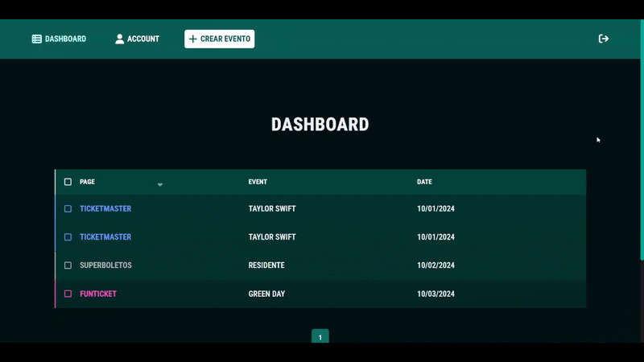

# 🎟️ Bicket – Case Study on SaaS Ticket Management

A case study of a SaaS prototype that evolved from the previous Tickets project, designed as a multi-client ticket management platform with a modern UI, landing page, and private dashboard.

---

## 🌍 Overview

Bicket is a SaaS prototype designed to improve on the minimal UI of the previous Tickets project.

Its goal was to provide a complete ticket management system where any registered client could create, edit, and delete tickets.

The platform included:

- A modern landing page with product explanation
- Interactive demos and videos
- Q&A and pricing sections
- User authentication (sign up & login)
- A private dashboard to manage tickets

Although currently paused, the project was envisioned to evolve into a full SaaS with payment integration, API services, and an admin panel.

---

## ✨ Features

- 🖥️ Landing page with product explanation and demo videos
- 🔐 User authentication (Sign up / Login)
- 📂 Dashboard for ticket management (create, edit, delete)
- 📊 Pricing and Q&A sections
- 🎨 Modern responsive UI with React + SASS

---

## 📸 Showcase

### 🏠 Homepage


### 👤 Register


### 🔐 Login


### 📊 Dashboard



---

## 🛠 Tech Stack

- **Frontend**: React, JavaScript (ES6+), SASS, CSS3
- **UI/UX**: Responsive design, custom SCSS architecture
- **Tools**: Vercel (deployment), video assets for demos

---

## 📂 Project Structure

```text
Bicket/
├── server/
│
├── client/
│   ├── public/
│   │
│   ├── src/
│   │   ├── assets/
│   │   │   ├── images/
│   │   │   ├── svg/
│   │   │   └── videos/
│   │   │
│   │   ├── components/
│   │   │   ├── Authentication/
│   │   │   │   ├── SignIn.jsx
│   │   │   │   └── SignUp.jsx
│   │   │   │
│   │   │   ├── ControlPanel/
│   │   │   │   ├── Dashboard/
│   │   │   │   ├── CreateEvent.jsx
│   │   │   │   └── Account.jsx
│   │   │   │
│   │   │   ├── General/
│   │   │   │   ├── Footer.jsx
│   │   │   │   └── Error404.jsx
│   │   │   │
│   │   │   └── Home/
│   │   │       ├── Features/
│   │   │       ├── Hero/
│   │   │       ├── Pricing/
│   │   │       └── QA/
│   │   │
│   │   ├── css/
│   │   │
│   │   ├── scss/
│   │   │
│   │   ├── utils/
│   │   │   ├── scrollToTop.js
│   │   │   ├── useColorPage.js
│   │   │   └── useDeviceSize.js
│   │   │
│   │   ├── App.jsx
│   │   ├── main.jsx
│   │   └── vite.config.js
│   │
│   ├── package.json
│   ├── index.html
│   └── README.md
│
└── README.md
```

---

## ⚙️ Installation & Setup

### Clone repository

```bash
git clone https://github.com/fockus26/bicket.git
cd bicket
```

### Install dependencies

```bash
cd client
npm install
```

### Run project

```bash
npm run dev
```

App will run on: http://localhost:5173

---

## 📖 Case Study

Bicket was envisioned as a SaaS evolution of the Tickets project.
It introduced a refined UI/UX, user authentication, and a scalable design for multiple clients.

Although the project remains paused due to pending features (payment gateway, API, admin panel), it represents an important step in building modern SaaS applications with React.

---

## 📈 Future Improvements

- 💳 Payment gateway integration (Stripe, PayPal)
- 🔌 Backend API (Flask/Node.js)
- 🛠️ Admin panel for global management
- 📱 Mobile-first optimization
- 🌐 Multi-language support

---

## 📜 License

This project is currently not open-source.
Code and design are reserved to the author.
